# Kong Konnect CI/CD Governance

This repository is the source of truth for Kong decK configuration and promotion flow across environments.

Detailed Azure DevOps operations documentation is available in [docs/azure-devops-system-guide.md](docs/azure-devops-system-guide.md).

For `OnPrem`, the current mechanism is:

- shared base state lives in `kong/internal/onprem/`
- environment values live in `kong/env/system/*.env` and `kong/env/user/*-onprem.env`
- the pipeline renders the shared base with the selected env file at runtime
- the rendered output is what `deck file validate`, `deck gateway diff`, and `deck gateway sync` operate on

## OnPrem Source Of Truth

The `OnPrem` control plane is no longer maintained as separate environment folders.

Use:

- shared config: `kong/internal/onprem/`
- system env files:
  - `kong/env/system/dev-system.env`
  - `kong/env/system/uat-system.env`
  - `kong/env/system/prod-system.env`
  - `kong/env/system/dr-system.env`
- user env files:
  - `kong/env/user/dev-onprem.env`
  - `kong/env/user/uat-onprem.env`
  - `kong/env/user/prod-onprem.env`

Do not create or maintain `kong/<env>/onprem` state folders for active `OnPrem` work.

## Repository Layout

Important `OnPrem` paths:

- `kong/internal/onprem/00-meta.yaml`
- `kong/internal/onprem/certificates/`
- `kong/internal/onprem/consumer-groups/`
- `kong/internal/onprem/consumers/`
- `kong/internal/onprem/partials/`
- `kong/internal/onprem/plugins/`
- `kong/internal/onprem/routes/`
- `kong/internal/onprem/services/`
- `kong/internal/onprem/vaults/`
- `kong/env/system/`
- `kong/env/user/`

Current object ownership:

- `services/`:
  primary place for service definitions
- `routes/`:
  contains route definitions attached to services through `service.name`
- `services/`:
  contains service-level plugins only
- `plugins/`:
  only for truly global plugins
- `consumers/`:
  consumer definitions, with `custom_id` parameterized through system env files
- `partials/`:
  shared redis and cache partials referenced by plugins

## Current OnPrem Authoring Pattern

Follow these rules when making changes:

1. Put service-specific changes in the matching file under `kong/internal/onprem/services/`.
2. Keep service definitions in `kong/internal/onprem/services/` and route definitions in `kong/internal/onprem/routes/`.
3. Keep service-specific plugins nested inside the owning service or route object.
4. Use standalone files under `kong/internal/onprem/plugins/` only for global plugins.
5. Do not hardcode environment-specific values in `kong/internal/onprem/`.
6. Use `__PLACEHOLDER__` tokens and define the real values in the matching `kong/env/system/*.env` or `kong/env/user/*-onprem.env` files.

Examples of parameterized values already in use:

- public host names
- upstream host names
- issuer URLs
- redis hosts and partial names
- vault config store IDs
- consumer `custom_id` values

Examples of shared values that stay in shared config:

- service and route names
- route paths
- common plugin structures
- shared `file-log` path `/usr/local/kong/logs/transaction.log`

## Current Service Pattern

The usual `OnPrem` service file now contains:

- one `services[]` entry
- service-level plugins such as `file-log`, `openid-connect`, or other API-specific plugins

The usual `OnPrem` route file now contains:

- one or more `routes[]` entries
- the owning `service.name` reference for each route
- route-level plugins such as `request-transformer`, `proxy-cache-advanced`, `pre-function`, or `post-function`

That means adding or changing an API usually requires touching the matching service file and route file, not embedding routes inside the service object.

## Current Consumer Pattern

Consumers live under `kong/internal/onprem/consumers/`.

Current rules:

- `username` stays in shared config
- `custom_id` must be parameterized if it differs by environment
- the matching env variable must exist in every required `kong/env/system/*.env` or `kong/env/user/*-onprem.env` file

Current parameter names include:

- `STANDARD_AMLA_API_USER_CUSTOM_ID`
- `STANDARD_BANCA_PORTAL_USER_CUSTOM_ID`
- `STANDARD_CLAIM_HISTORY_USER_CUSTOM_ID`

If a value is not yet known for an environment, use a clear `CHANGE_ME_...` placeholder until the real value is available.

## Branching Strategy

- `development` is used for deployment to Dev.
- `master` is used for deployment to Uat, promotions to PreProd/Prod/DR, and rollback to Uat/Prod.
- Feature work is done in feature branches and merged via PR.
- Hotfix work can branch from `master` and merge back to `master`.

## Pipeline Model

The pipeline is manual-only:

- `trigger: none`
- `pr: none`

Run via Azure DevOps `Run pipeline` with parameters:

- `mode`: `deployment` or `promotion` or `rollback`
- `environment`: `Dev`, `Uat`, `PreProd`, `Prod`, `DR`
- `controlPlane`: `OnPremise`
- `rollbackBuildId`: required when `mode=rollback`
- `rollbackBackupFile`: required when `mode=rollback`

If `Commit` is filled, the pipeline explicitly pins checkout to `Build.SourceVersion` and fails if the checked-out commit does not match.

## Azure DevOps Prerequisites

Create these variables in Azure DevOps:

- `KONG_TOKEN`
  secret used by decK
- `KONG_ADDR`
  Konnect API base URL

Without these values, deployment, promotion, and rollback will fail.

## Environment Files

Each rendered environment is composed from:

- `kong/env/system/<env>-system.env`
- `kong/env/user/<env>-onprem.env`

Values currently parameterized include:

- `CONTROL_PLANE_NAME`
- `ENV_TAG_LOWER`
- `INTERNAL_TLS_HOST`
- `PUBLIC_HOST_PRIMARY`
- `PUBLIC_HOST_SECONDARY`
- `AML_REST_SERVICE_HOST`
- `BANCAWEB_SERVICE_HOST`
- `CLAIMHISTORY_STORM_SERVICE_HOST`
- `KYC_WSMANAGER_SERVICE_HOST`
- `AML_REST_SERVICE_PROTOCOL`
- `BANCAWEB_SERVICE_PROTOCOL`
- `CLAIMHISTORY_STORM_SERVICE_PROTOCOL`
- `KYC_WSMANAGER_SERVICE_PROTOCOL`
- `CORS_ALLOWED_ORIGIN`
- `AML_REST_SERVICE_PORT`
- `BANCAWEB_SERVICE_PORT`
- `CLAIMHISTORY_STORM_SERVICE_PORT`
- `KYC_WSMANAGER_SERVICE_PORT`
- `BANCA_AUTHENTICATE_UPSTREAM_URI`
- `BANCA_LOGIN_UPSTREAM_URI`
- `BANCA_LOGOUT_UPSTREAM_URI`
- `BANCA_CALCULATE_UPSTREAM_URI`
- `BANCA_EQUOTATION_UPSTREAM_URI`
- `GET_TOKEN_SERVICE_NAME`
- `GET_TOKEN_SERVICE_HOST`
- `ISSUER_URL`
- `REDIS_HOST`
- `REDIS_PASSWORD`
- `REDIS_PARTIAL_NAME`
- `REDIS_CACHE_PARTIAL_NAME`
- `VAULT_CONFIG_STORE_ID`
- `STANDARD_AMLA_API_RATE_LIMIT`
- `STANDARD_BANCA_PORTAL_RATE_LIMIT`
- `STANDARD_CLAIM_HISTORY_RATE_LIMIT`
- `STANDARD_AMLA_API_USER_CUSTOM_ID`
- `STANDARD_BANCA_PORTAL_USER_CUSTOM_ID`
- `STANDARD_CLAIM_HISTORY_USER_CUSTOM_ID`

OnPrem user env value descriptions:

| Variable | Description |
| --- | --- |
| `INTERNAL_TLS_HOST` | Internal TLS/SNI host for the selected dataplane environment. |
| `PUBLIC_HOST_PRIMARY` | Primary public host opened on the dataplane for each environment, for example `dev`, `uat`, `prod`, `dr`, or `preprod`. |
| `PUBLIC_HOST_SECONDARY` | Secondary public host opened on the dataplane for each environment. Leave blank when no secondary host is required. |
| `AML_REST_SERVICE_HOST` | Upstream host for the AML REST service in the selected environment. |
| `BANCAWEB_SERVICE_HOST` | Upstream host for the BancaWeb service in the selected environment. |
| `CLAIMHISTORY_STORM_SERVICE_HOST` | Upstream host for the Claim History Storm service in the selected environment. |
| `KYC_WSMANAGER_SERVICE_HOST` | Upstream host for the KYC WSManager service in the selected environment. |
| `AML_REST_SERVICE_PROTOCOL` | Upstream protocol used by Kong when proxying to the AML REST service, such as `http` or `https`. |_HOST=Upstream host for the BancaWeb service in the selected environment.
| `BANCAWEB_SERVICE_PROTOCOL` | Upstream protocol used by Kong when proxying to the BancaWeb service, such as `http` or `https`. |
| `CLAIMHISTORY_STORM_SERVICE_PROTOCOL` | Upstream protocol used by Kong when proxying to the Claim History Storm service, such as `http` or `https`. |
| `KYC_WSMANAGER_SERVICE_PROTOCOL` | Upstream protocol used by Kong when proxying to the KYC WSManager service, such as `http` or `https`. |
| `CORS_ALLOWED_ORIGIN` | Allowed origin value for the global CORS plugin. Use `*` only when all origins should be allowed. |
| `AML_REST_SERVICE_PORT` | Upstream port used by Kong when proxying to the AML REST service. |
| `BANCAWEB_SERVICE_PORT` | Upstream port used by Kong when proxying to the BancaWeb service. |
| `CLAIMHISTORY_STORM_SERVICE_PORT` | Upstream port used by Kong when proxying to the Claim History Storm service. |
| `KYC_WSMANAGER_SERVICE_PORT` | Upstream port used by Kong when proxying to the KYC WSManager service. |
| `BANCA_AUTHENTICATE_UPSTREAM_URI` | BancaWeb upstream URI used for the authentication route request rewrite. |
| `BANCA_LOGIN_UPSTREAM_URI` | BancaWeb upstream URI used for the login route request rewrite. |
| `BANCA_LOGOUT_UPSTREAM_URI` | BancaWeb upstream URI used for the logout route request rewrite. |
| `BANCA_CALCULATE_UPSTREAM_URI` | BancaWeb upstream URI used for the calculate route request rewrite. |
| `BANCA_EQUOTATION_UPSTREAM_URI` | BancaWeb upstream URI used for the eQuotation route request rewrite. |
| `STANDARD_AMLA_API_RATE_LIMIT_MINUTE` | Standard AMLA API consumer rate limit per minute. |
| `STANDARD_AMLA_API_RATE_LIMIT_HOUR` | Standard AMLA API consumer rate limit per hour. |
| `STANDARD_BANCA_PORTAL_RATE_LIMIT_MINUTE` | Standard Banca Portal consumer rate limit per minute. |
| `STANDARD_BANCA_PORTAL_RATE_LIMIT_HOUR` | Standard Banca Portal consumer rate limit per hour. |
| `STANDARD_CLAIM_HISTORY_RATE_LIMIT_MINUTE` | Standard Claim History consumer rate limit per minute. |
| `STANDARD_CLAIM_HISTORY_RATE_LIMIT_HOUR` | Standard Claim History consumer rate limit per hour. |

Notes:

- `PUBLIC_HOST_PRIMARY` is required
- `PUBLIC_HOST_SECONDARY` is optional
- user-editable values such as hosts and standard rate limits belong in `kong/env/user/`
- internal values such as consumer custom IDs and Redis partial IDs belong in `kong/env/system/`

## Deployment And Promotion Flow

Deployment and promotion use one operational flow after the target state is prepared.
The only difference is how the rendered target state is selected:

- `deployment` renders the selected environment directly.
- `promotion` renders the target environment for the target control plane.
- `DR` promotion renders from the production env files and injects DR Redis partial references through a runtime override.

Merged flow image:

Deployment-only flow image:

Promotion-only flow image:

```mermaid
flowchart LR
    A[Azure DevOps pipeline triggered] --> B[Checkout repository]
    B --> C[Load environment files<br/>deployment: selected env<br/>promotion: target env or override]
    C --> D[Replace placeholders<br/>host, port, protocol,<br/>vault refs, Redis partials]
    D --> E[Validate Kong declarative config]
    E --> F{Failed?}
    F -->|Verification failed| G[End pipeline]
    F -->|Verification pass| H[Deploy / sync config<br/>to Kong control plane]
    H --> I[Post-deployment verification<br/>routes, auth, plugins, upstream]
    I --> J[Deployment or promotion completed]

    classDef default fill:#f2f2f2,stroke:#999,stroke-width:2px,color:#333;
    classDef decision fill:#fff2c6,stroke:#d3aa32,stroke-width:2px,color:#333;
    classDef success fill:#dcefd7,stroke:#7db36f,stroke-width:2px,color:#333;
    classDef stop fill:#f3cccc,stroke:#c65353,stroke-width:2px,color:#333;
    class F decision;
    class G stop;
    class J success;
```

Merged high-level behavior:

1. Checkout repository and pin to the selected commit ID.
2. Install decK.
3. Validate required secrets.
4. Prepare the target state for the selected mode.
5. Render `kong/internal/onprem` with the selected `kong/env/user/*-onprem.env`, which is merged with the matching `kong/env/system/*-system.env` and optional promotion override.
6. Replace placeholders for hosts, ports, protocol, vault refs, Redis partials, and other environment values.
7. Run `deck gateway ping`, validation, and `deck gateway diff` on the rendered output. Promotion also runs the rendered Redis partial reference check before `deck file validate`.
8. If changes exist, back up current state.
9. Publish the backup artifact.
10. Run `deck gateway sync`.

Promotion behavior:

- promotion does not copy repo folders for `OnPrem`
- it renders the same shared base using the target environment file
- then it runs the same ping, validation, diff, backup, artifact, and sync steps as deployment
- `DR` promotion does not use `kong/env/user/dr-onprem.env`
- `DR` promotion renders from `kong/env/user/prod-onprem.env` and switches Redis-backed plugin references through an override

## Rollback Flow

Rollback re-applies backup dump state from a previous run artifact to the selected target control plane.

High-level flow:

1. Validate run rules and rollback parameters.
2. Download the requested backup artifact.
3. Resolve the selected backup YAML file.
4. Verify the rollback file matches the intended target control plane.
5. Run `deck gateway ping`, `deck file validate`, and `diff`.
6. If changes exist, run `deck gateway sync` using the rollback file.

## Validation Checklist

Before creating a PR or deployment run:

1. Confirm changes were made under `kong/internal/onprem/`, `kong/env/system/`, or `kong/env/user/`.
2. Confirm no environment-specific literals were added to shared state.
3. Confirm every new `__PLACEHOLDER__` has values in all required env files.
4. Confirm service-specific routes are stored under `kong/internal/onprem/routes/` and point to the correct `service.name`.
5. Confirm any new consumer `custom_id` placeholder exists in all env files.
6. Run `deck file validate` against the rendered or target state used by the pipeline.
