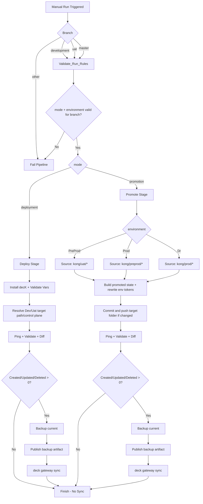

# Kong Konnect CI/CD Governance

This repository is the source of truth for Kong decK configuration and promotion flow across environments.

## Naming Conventions

| Component | Naming Convention | Sample |
| --- | --- | --- |
| Azure Repos Repository | `<environment>-kong` | `dev-kong.conf` |
| Azure DevOps Pipeline | `<external/internal>-api-<deployment/promotion>-pipeline` | `internal-api-deployment-pipeline` |
| Kong Control Plane | `<environment>-<data-center>` | `development-azure` |
| Kong Gateway Service | `<application-name>-<env>` | `saldo-dev` |
| Kong API Route | `<application-name>-<env>-route` | `saldo-dev-route` |

## Branching Strategy

- `development` is used for deployment to Dev.
- `master` is used for deployment to Uat, promotions to PreProd/Prod/Dr, and rollback to Uat/Prod.
- Feature work is done in feature branches and merged via PR.
- Hotfix work can branch from `master` and merge back to `master`.

## Pipeline Model

The pipeline is manual-only:

- `trigger: none`
- `pr: none`

Run via Azure DevOps `Run pipeline` with parameters:

- `mode`: `deployment` or `promotion` or `rollback`
- `environment`: `Dev`, `Uat`, `PreProd`, `Prod`, `Dr`
- `controlPlane`: `OnCloud` or `OnPremise`
- `rollbackBuildId`: required when `mode=rollback`, points to the source pipeline `BuildId` that published backup artifact

## Governance Rules (Enforced)

The stage `Validate_Run_Rules` blocks invalid combinations and fails the run.

Allowed combinations:

1. Deployment to Dev
- `mode=deployment`
- `environment=Dev`
- branch `refs/heads/development`

2. Deployment to Uat
- `mode=deployment`
- `environment=Uat`
- branch `refs/heads/master`

3. Promotion Uat -> PreProd
- `mode=promotion`
- `environment=PreProd`
- branch `refs/heads/master`

4. Promotion PreProd -> Prod
- `mode=promotion`
- `environment=Prod`
- branch `refs/heads/master`

5. Promotion Prod -> Dr
- `mode=promotion`
- `environment=Dr`
- branch `refs/heads/master`

6. Rollback to Dev
- `mode=rollback`
- `environment=Dev`
- branch `refs/heads/development`

7. Rollback to Uat
- `mode=rollback`
- `environment=Uat`
- branch `refs/heads/master`

8. Rollback to Prod
- `mode=rollback`
- `environment=Prod`
- branch `refs/heads/master`

Any other combination fails in the guard stage.

## Deployment and Promotion Flow

Shared high-level behavior:

1. Install decK.
2. Validate required secrets (`KONG_TOKEN`, `KONG_ADDR`).
3. Resolve control plane and desired state path.
4. Ping gateway, validate config, run diff.
5. If any diff summary count is non-zero (`Created`, `Updated`, `Deleted`), treat as changes.
6. Backup current state.
7. Publish backup as pipeline artifact.
8. Run `deck gateway sync`.

Promotion-specific repository behavior:

1. Promotion rebuilds target folder in repo working tree:
- `Uat -> PreProd` uses `kong/uat/<cp>` as source and rewrites into `kong/preprod/<cp>`
- `PreProd -> Prod` uses `kong/preprod/<cp>` as source and rewrites into `kong/prod/<cp>`
- `Prod -> Dr` uses `kong/prod/<cp>` as source and rewrites into `kong/dr/<cp>`
2. It rewrites environment tokens in YAML and updates `control_plane_name`.
3. If folder content changed, pipeline commits and pushes those folder updates back to the same branch.

## Backup Mechanism

Backups are created only when changes are detected.

Backup location on agent:

- `$(Build.ArtifactStagingDirectory)/kong-backup`

Backup file:

1. Current state dump:
- `<control-plane>-current-before-sync-<timestamp>.yaml`

Published artifact name:

- `kong-backup-<environment>-<controlPlane>-<BuildId>`

Note: backup files are not committed to this repo; they are available in Azure DevOps run artifacts.

## Rollback Flow

Rollback re-applies backup dump state from a previous run artifact to the selected target control plane.

1. Validate run rules and ensure `rollbackBuildId` is provided.
2. Download artifact named `kong-backup-<environment>-<controlPlane>-<rollbackBuildId>`.
3. Resolve rollback source file using `*-current-before-sync-*.yaml`.
4. Run `deck gateway ping`, `validate`, and `diff`.
5. If diff shows changes, execute `deck gateway sync` using the resolved rollback dump file.

### 6.4. Pipeline Automation with Azure DevOps

To execute this strategy reliably, manual intervention must be eliminated. All backup, restore, and rollback operations will be handled by Azure Pipelines.

## Mermaid Flow Diagram

