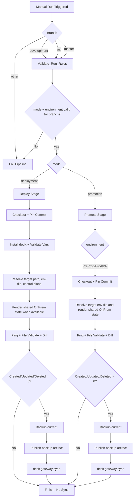

# Kong Konnect CI/CD Governance

This repository is the source of truth for Kong decK configuration and promotion flow across environments.

For `OnPrem`, the source of truth is:

- shared base: `kong/internal/onprem`
- environment values: `kong/env/*.env`

## Naming Conventions

| Component | Naming Convention | Sample |
| --- | --- | --- |
| Azure Repos Repository | `<environment>-kong` | `dev-kong.conf` |
| Azure DevOps Pipeline | `<external/internal>-api-<deployment/promotion>-pipeline` | `internal-api-deployment-pipeline` |
| Kong Control Plane | `<environment>-<data-center>` | `development-azure` |
| Kong Gateway Service | `<application-name>-<env>` | `saldo-dev` |
| Kong API Route | `<application-name>-<env>-route` | `saldo-dev-route` |

## Branching Strategy

- `development` is used for deployment to Dev.
- `master` is used for deployment to Uat, promotions to PreProd/Prod/DR, and rollback to Uat/Prod.
- Feature work is done in feature branches and merged via PR.
- Hotfix work can branch from `master` and merge back to `master`.

## Pipeline Model

The pipeline is manual-only:

- `trigger: none`
- `pr: none`

Run via Azure DevOps `Run pipeline` with parameters:

- `mode`: `deployment` or `promotion` or `rollback`
- `environment`: `Dev`, `Uat`, `PreProd`, `Prod`, `DR`
- `controlPlane`: `OnCloud` or `OnPremise`
- `rollbackBuildId`: required when `mode=rollback`, points to the source pipeline `BuildId` that published backup artifact
- `rollbackBackupFile`: required when `mode=rollback`, exact backup YAML filename inside the published artifact

Azure DevOps also exposes:

- `Branch/tag`
- `Commit`

If `Commit` is filled, the pipeline explicitly pins checkout to `Build.SourceVersion` and fails if the checked-out commit does not match.

## Azure DevOps Prerequisites

Before running any pipeline, create these variables in Azure DevOps:

- `KONG_TOKEN`
  - secret
  - Konnect access token used by decK
- `KONG_ADDR`
  - plain text
  - Konnect API base URL
  - masked example: `https://<region>.api.konghq.com`

Recommended:

- store them in a variable group
- link that variable group to this pipeline

Without these values, deployment, promotion, and rollback will fail in the `Validate required variables` step.

## Environment Setup

For `OnPrem`, each environment must have a matching env file under `kong/env/`.

Current files:

- `kong/env/dev-onprem.env`
- `kong/env/uat-onprem.env`
- `kong/env/preprod-onprem.env`
- `kong/env/prod-onprem.env`
- `kong/env/dr-onprem.env`

Each env file contains the values used to render the shared base.

Values that usually must be reviewed per environment:

- `CONTROL_PLANE_NAME`
- `ENV_TAG_LOWER`
- `INTERNAL_TLS_HOST`
- `PUBLIC_HOST_PRIMARY`
- `PUBLIC_HOST_SECONDARY`
- `AML_REST_SERVICE_HOST`
- `BANCAWEB_SERVICE_HOST`
- `CLAIMHISTORY_STORM_SERVICE_HOST`
- `KYC_WSMANAGER_SERVICE_HOST`
- `GET_TOKEN_SERVICE_NAME`
- `GET_TOKEN_SERVICE_HOST`
- `ISSUER_URL`
- `REDIS_HOST`
- `REDIS_PASSWORD`
- `REDIS_PARTIAL_NAME`
- `REDIS_CACHE_PARTIAL_NAME`
- `VAULT_CONFIG_STORE_ID`

### First-Time Setup For Uat / PreProd / Prod / DR

Before first deployment to a new environment, make sure these dependencies already exist in Konnect for that target environment:

1. Identity issuer / identity domain
- example:
  - `Dev-OnPremise` -> `https://<dev-identity-domain>.sg.identity.konghq.com/auth`
  - `Uat-OnPremise` -> `https://<uat-identity-domain>.sg.identity.konghq.com/auth`
  - `Prod-OnPremise` -> `https://<prod-identity-domain>.sg.identity.konghq.com/auth`
- update both:
  - `ISSUER_URL`
  - `GET_TOKEN_SERVICE_HOST`

2. Vault `konnect` with prefix `identity`
- create the vault in the target control plane if it does not exist yet
- after creating it, get the JSON and copy:
  - `config.config_store_id`
- put that value into:
  - `VAULT_CONFIG_STORE_ID`

Important:

- do not use the top-level vault `id`
- use only `config.config_store_id`

Example:

If Konnect returns:

```json
{
  "config": {
    "config_store_id": "<config-store-id>"
  },
  "id": "<vault-id>",
  "name": "konnect",
  "prefix": "identity"
}
```

Then the env file must contain:

```env
VAULT_CONFIG_STORE_ID=<config-store-id>
```

Not:

```env
VAULT_CONFIG_STORE_ID=<vault-id>
```

3. Review route and certificate hostnames for the target environment
- set:
  - `INTERNAL_TLS_HOST`
  - `PUBLIC_HOST_PRIMARY`
  - `PUBLIC_HOST_SECONDARY`
- `PUBLIC_HOST_SECONDARY` may be left blank

4. Review any environment-specific upstream and cache values
- `AML_REST_SERVICE_HOST`
- `BANCAWEB_SERVICE_HOST`
- `CLAIMHISTORY_STORM_SERVICE_HOST`
- `KYC_WSMANAGER_SERVICE_HOST`
- `REDIS_HOST`
- `REDIS_PASSWORD`
- `REDIS_PARTIAL_NAME`
- `REDIS_CACHE_PARTIAL_NAME`

### Parameter Checklist By Environment

Before first run for each environment, verify:

`Dev-OnPremise`
- `CONTROL_PLANE_NAME=Dev-OnPremise`
- `GET_TOKEN_SERVICE_NAME=Dev-OnPremise-Get-Token`
- `GET_TOKEN_SERVICE_HOST=<dev-identity-domain>.sg.identity.konghq.com`
- `ISSUER_URL=https://<dev-identity-domain>.sg.identity.konghq.com/auth`
- `VAULT_CONFIG_STORE_ID` matches the Dev config store

`Uat-OnPremise`
- `CONTROL_PLANE_NAME=Uat-OnPremise`
- `GET_TOKEN_SERVICE_NAME=Uat-OnPremise-Get-Token`
- `GET_TOKEN_SERVICE_HOST=<uat-identity-domain>.sg.identity.konghq.com`
- `ISSUER_URL=https://<uat-identity-domain>.sg.identity.konghq.com/auth`
- `VAULT_CONFIG_STORE_ID` matches the UAT config store

`PreProd-OnPremise`
- `CONTROL_PLANE_NAME=PreProd-OnPremise`
- `GET_TOKEN_SERVICE_NAME=PreProd-OnPremise-Get-Token`
- set the real PreProd identity host and issuer before first run
- set the real PreProd `VAULT_CONFIG_STORE_ID` before first run

`Prod-OnPremise`
- `CONTROL_PLANE_NAME=Prod-OnPremise`
- `GET_TOKEN_SERVICE_NAME=Prod-OnPremise-Get-Token`
- `GET_TOKEN_SERVICE_HOST=<prod-identity-domain>.sg.identity.konghq.com`
- `ISSUER_URL=https://<prod-identity-domain>.sg.identity.konghq.com/auth`
- `VAULT_CONFIG_STORE_ID` matches the Prod config store

`DR-OnPremise`
- `CONTROL_PLANE_NAME=DR-OnPremise`
- `GET_TOKEN_SERVICE_NAME=DR-OnPremise-Get-Token`
- set the real DR identity host and issuer before first run
- set the real DR `VAULT_CONFIG_STORE_ID` before first run

## Governance Rules (Enforced)

The stage `Validate_Run_Rules` blocks invalid combinations and fails the run.

Allowed combinations:

1. Deployment to Dev
- `mode=deployment`
- `environment=Dev`
- branch `refs/heads/development`

2. Deployment to Uat
- `mode=deployment`
- `environment=Uat`
- branch `refs/heads/master`

3. Promotion Uat -> PreProd
- `mode=promotion`
- `environment=PreProd`
- branch `refs/heads/master`

4. Promotion PreProd -> Prod
- `mode=promotion`
- `environment=Prod`
- branch `refs/heads/master`

5. Promotion Prod -> DR
- `mode=promotion`
- `environment=DR`
- branch `refs/heads/master`

6. Rollback to Dev
- `mode=rollback`
- `environment=Dev`
- branch `refs/heads/development`

7. Rollback to Uat
- `mode=rollback`
- `environment=Uat`
- branch `refs/heads/master`

8. Rollback to Prod
- `mode=rollback`
- `environment=Prod`
- branch `refs/heads/master`

Any other combination fails in the guard stage.

## Deployment and Promotion Flow

Shared high-level behavior:

1. Checkout repository and pin to the selected commit ID.
2. Install decK.
3. Validate required secrets (`KONG_TOKEN`, `KONG_ADDR`).
4. Resolve control plane and desired state path.
5. Render shared `OnPrem` state when applicable.
6. Ping gateway, validate config locally, run diff.
7. If any diff summary count is non-zero (`Created`, `Updated`, `Deleted`), treat as changes.
8. Backup current state.
9. Publish backup as pipeline artifact.
10. Run `deck gateway sync`.

OnPrem repository behavior:

1. `kong/internal/onprem` is the shared base template.
2. The selected target environment loads:
- `kong/env/dev-onprem.env`
- `kong/env/uat-onprem.env`
- `kong/env/preprod-onprem.env`
- `kong/env/prod-onprem.env`
- `kong/env/dr-onprem.env`
3. The pipeline renders the shared base into a temporary folder and deploys that rendered output.
4. `kong/<env>/onprem` folders are no longer used for `OnPrem`.

Environment files currently parameterize:

- `CONTROL_PLANE_NAME`
- `ENV_TAG_LOWER`
- `INTERNAL_TLS_HOST`
- `PUBLIC_HOST_PRIMARY`
- `PUBLIC_HOST_SECONDARY` (optional)
- `AML_REST_SERVICE_HOST`
- `BANCAWEB_SERVICE_HOST`
- `CLAIMHISTORY_STORM_SERVICE_HOST`
- `KYC_WSMANAGER_SERVICE_HOST`
- `GET_TOKEN_SERVICE_NAME`
- `GET_TOKEN_SERVICE_HOST`
- `ISSUER_URL`
- `REDIS_HOST`
- `REDIS_PASSWORD`
- `REDIS_PARTIAL_NAME`
- `REDIS_CACHE_PARTIAL_NAME`
- `VAULT_CONFIG_STORE_ID`

Notes:

- `PUBLIC_HOST_PRIMARY` is required.
- `PUBLIC_HOST_SECONDARY` is optional. If blank, the renderer removes the second `hosts` entry so route YAML stays valid.
- `VAULT_CONFIG_STORE_ID` must match the live config store binding intended for that environment. Changing it on an already-used vault may fail due to Konnect reference constraints.

Promotion-specific repository behavior:

1. For shared `OnPrem`, promotion no longer copies repo folders. It renders `kong/internal/onprem` using the target environment file and deploys directly to the target control plane.
2. Legacy folder-copy promotion is still used for control planes that do not have a shared base template.

## Backup Mechanism

Backups are created only when changes are detected.

Backup location on agent:

- `$(Build.ArtifactStagingDirectory)/kong-backup`

Backup file:

1. Current state dump:
- `<control-plane>-current-before-sync-<timestamp>.yaml`

Published artifact name:

- `kong-backup-<environment>-<controlPlane>-<BuildId>`

Note: backup files are not committed to this repo; they are available in Azure DevOps run artifacts.

## Rollback Flow

Rollback re-applies backup dump state from a previous run artifact to the selected target control plane.

1. Validate run rules and ensure `rollbackBuildId` and `rollbackBackupFile` are provided.
2. Download artifact named `kong-backup-<environment>-<controlPlane>-<rollbackBuildId>`.
3. Resolve rollback source file using the exact `rollbackBackupFile` parameter value.
4. Validate rollback alignment:
- the selected rollback file must come from the requested rollback artifact download
- rollback YAML `control_plane_name` must exactly match the selected target control plane
5. Run `deck gateway ping`, `deck file validate`, and `diff`.
6. If diff shows changes, execute `deck gateway sync` using the resolved rollback dump file.

### 6.4. Pipeline Automation with Azure DevOps

To execute this strategy reliably, manual intervention must be eliminated. All backup, restore, and rollback operations will be handled by Azure Pipelines.

## Mermaid Flow Diagram


